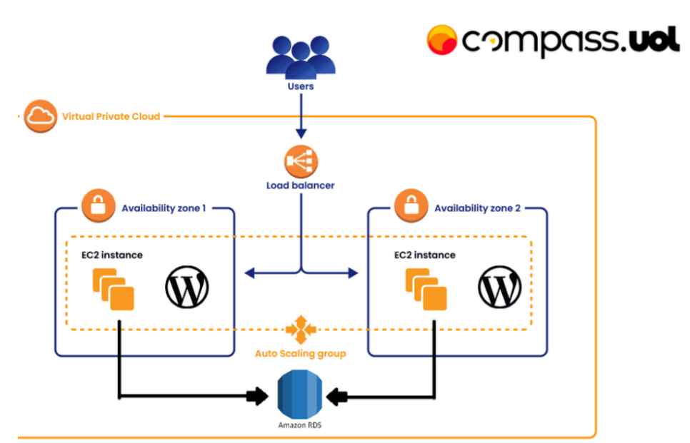
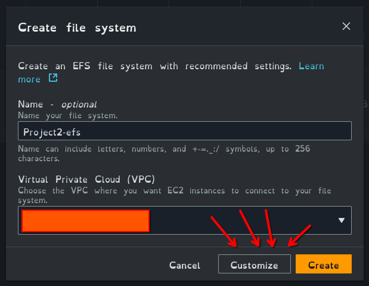
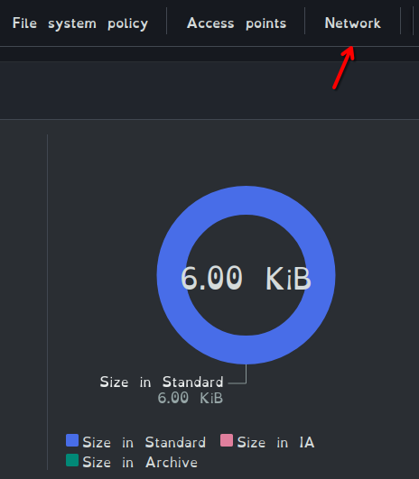
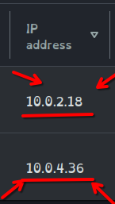
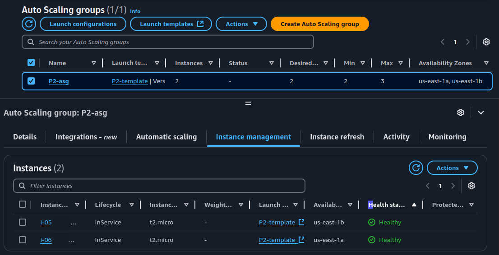
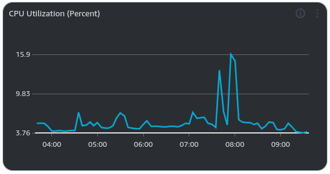
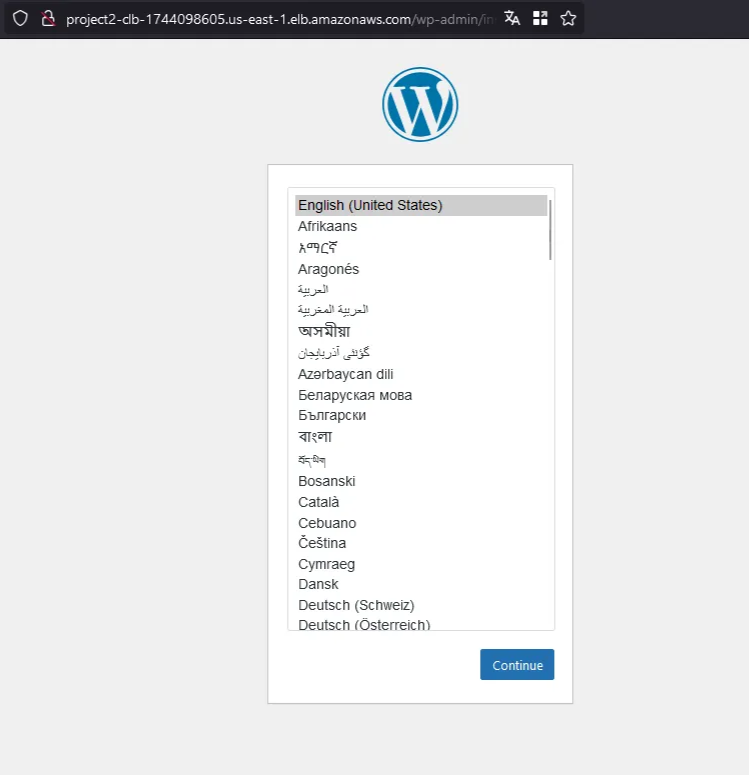
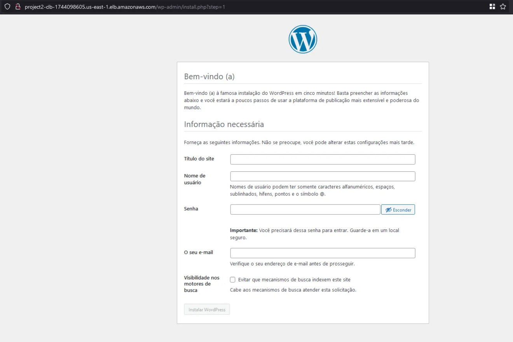
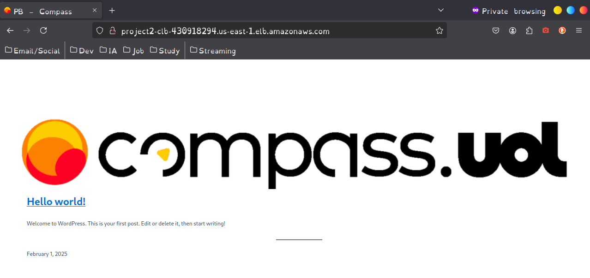

# Guia Completo de Deploy de WordPress na AWS com Docker: Arquitetura Escalável e Alta Disponibilidade


# 📖 0. Índice


[🚀 1. Introdução](#introducao)

[🛠️ 2. Pré-requisitos](#pre-requisitos)

[☁️ 3. Criação da Rede AWS](#criacao-da-rede-aws)

[🛡️ 4. Configuração de Grupos de Segurança](#configuracao-de-grupos-de-seguranca)

[🏦 5. Preparando o Banco de Dados MySQL (RDS) ](#preparando-o-banco-de-dados-mysql-rds)

[📁 6. Configuração do EFS para Arquivos Estáticos](#configuracao-do-efs-para-arquivos-estaticos)

[⬆️ 7. Configuração do Auto Scaling Group](#configuracao-do-auto-scaling-group) 

[⚖️ 8. Configurando o Load Balancer](#configurando-o-load-balancer)

[🐳 9. Verificação da Configuração no Host EC2](#verificacao-da-configuracao-no-host-ec2)

[📊 10. Monitoramento e Manutenção (EXTRA)](#monitoramento-e-manutencao-extra)

[🏁 11. Conclusão](#conclusao)


---

# 🚀 1. Introdução <a id="introducao"></a>

## 1.1 Objetivo do Projeto

Este projeto tem como foco implantar uma aplicação **WordPress** em uma infraestrutura de nuvem **AWS** com a utilização de **Docker** para conteinerização. 

O ambiente contará com um banco de dados **MySQL** gerenciado pelo **Amazon RDS**, um sistema de arquivos escalável através do **Amazon EFS** para armazenamento de arquivos estáticos, e um **Load Balancer** para distribuir o tráfego entre diferentes instâncias **EC2**.

O principal objetivo é criar uma infraestrutura que seja **escalável**, **altamente disponível**, e que suporte o crescimento do tráfego de forma automatizada. Tudo isso será orquestrado em uma **VPC** (Virtual Private Cloud), que permitirá a criação de subnets tanto públicas quanto privadas para melhor segurança e performance.

## 1.2 Visão Geral da Arquitetura



### **A arquitetura do projeto consiste nos seguintes componentes principais:**

- **Instâncias EC2:** Hospedam os containers **Docker** com a aplicação **WordPress**.
- **Amazon RDS (MySQL):** Banco de dados **MySQL** gerenciado pela **AWS**.
- **Amazon EFS:** Sistema de arquivos para armazenar os arquivos estáticos do **WordPress**.
- **Load Balancer:** Balanceando a carga, distribui o tráfego entre as instâncias **EC2** em diferentes **AZ.**
- **Auto Scaling Group:** Garante que a aplicação escale automaticamente com base na demanda.

---

# 🛠️ 2. Pré-requisitos <a id="pre-requisitos"></a>

### **Antes de iniciar o projeto, é necessário:**

- Uma **conta ativa** na **AWS**.
- Conhecimento básico de:
    - **Docker** para containerização.
    - **AWS** com foco em **EC2, RDS, EFS, e Load Balancer.**
    - **WordPress**.
- Acesso ao **AWS Management Console**.
- Um par de chaves **SSH** prontas para uso no acesso de **instâncias EC2** dentro do ambiente **aws.**
    - Caso não tenha chave **ssh** no ambiente **aws**, clicar em:
        - Recursos **EC2. > D**entro de Network e Security **> Key Pairs > Create New.**
            - Escolha um Nome**: `Project2` (** recomendado **)**
            - Tipo**: RSA**
            - Formato**: .pem**
            - Clicar em criar que será criado e também baixado automaticamente, porém essa que foi feito o download não será utilizado.

---

# ☁️ 3. Criação da Rede AWS <a id="criacao-da-rede-aws"></a>

Nesta etapa, vamos preparar a infraestrutura na **AWS**, criando uma **VPC, sub-redes, gateways** e **tabelas de rotas** necessários para garantir um ambiente seguro e escalável para nossa aplicação.

## 3.1 Criação da VPC

- Crie uma **VPC** com um bloco CIDR adequado, por exemplo, `10.0.0.0/16`. Isso permite até 65.536 endereços IP privados.
- Nome Sugerido: `Project2-vpc`

## 3.2 Criar um Internet Gateway (IGW)

Este gateway permitirá que a **subnet pública** (onde o CLB e o NAT Gateway estão localizados) tenha acesso à internet.

1. Dentro da **VPC**, clique em → **Internet Gateway**.
2. Crie um **Internet Gateway** e associe-o à **VPC**.

## 3.3 Configurar Subnets (Subnetworks)

### 3.31 **Subnet Pública** (para o CLB)

1. **Crie uma subnet pública em duas AZs** para garantir **alta disponibilidade** do CLB.
    - **AZ 1**: `us-east-1a` com bloco CIDR `10.0.1.0/24`
    - **AZ 2**: `us-east-1b` com bloco CIDR `10.0.3.0/24`
2. **Associar a Tabela de Rotas** com **Internet Gateway** (IGW):
    - Adicione uma rota para `0.0.0.0/0` com o **Internet Gateway** como destino.
    - **Associar a Tabela de Rotas** a essas duas subnets públicas.

### 3.3.2 **Subnets Privadas**

1. Crie **duas subnets privadas** em **duas AZs** (por exemplo, `us-east-1a` e `us-east-1b`), para garantir que as instâncias EC2 também estejam distribuídas entre as AZs e tenham alta disponibilidade.
    - **Subnet Privada 1a (us-east-1a)**: `10.0.2.0/24`
    - **Subnet Privada 1b (us-east-1b)**: `10.0.4.0/24`

1. Essas subnets serão usadas pelas **instâncias EC2** (por exemplo, WordPress).
2. **Não associe um Internet Gateway diretamente a essas subnets**. Em vez disso, use um **NAT Gateway** público (**3.4**) para permitir que as instâncias privadas acessem a internet de forma segura.

## 3.4 Criar duas NAT Gateway Público

Esse **NAT Gateway** permitirá que as instâncias nas **subnets privadas** acessem a internet de forma segura, sem expor seus endereços IP públicos.

1. Crie um **NAT Gateway** em **cada subnet pública**(`10.0.1.0/24` e `10.0.3.0/24`) para garantir redundância.
    - **Subnets: (`10.0.1.0/24` e `10.0.3.0/24`)**
    - **Tipo de conectividade: *public***
    - **Associar um novo Elastic IP (EIP)** em cada NAT Gateway (isso ocorre dentro do processo de criação do NAT Gateway, a não ser que queira fazer isso por fora e escolher um ip pré determinado).

## 3.5 Configurar Tabelas de Rotas

### 3.5.1 **Tabela de Rotas para a Subnet Pública** (para o CLB)

- Adicione uma rota para `0.0.0.0/0` com o **Internet Gateway** como destino.
- **Associe essa tabela de rotas às duas subnets públicas** (uma em cada AZ).
- **O CLB deve estar nas duas subnets públicas**, para garantir a **alta disponibilidade**.

### 3.5.2 **Tabela de Rotas para as 2 Subnets Privadas**

- Adicione uma rota para `0.0.0.0/0` com o **NAT Gateway** como destino.
    - **Importante**: O **NAT Gateway** pode ser redundante se você usar um em cada subnet pública.
- **Associe essas tabelas de rotas às subnets privadas**.

---

## 3.6 Subnet Associations

⚠️ Uma vez com as route tables criadas, ir em cada **route table > em “Subnet Associations”** e ajustar a paridade.

- **Para Route Table `P2-rtb-public-1a` > Associar a Subnet `P2-public-1a`**
- **Para Route Table `P2-rtb-public-1b` > Associar a Subnet `P2-public-1b`**
- **Para Route Table `P2-rtb-private-1a` > Associar a Subnet `P2-private-1a`**
- **Para Route Table `P2-rtb-private-1b` > Associar a Subnet `P2-private-1b`**

## 3.7 Resumo das Configurações das Subnets

**Seu Resource Map deve se parecer com:**


| Subnet | AZ | Bloco CIDR | Uso Principal | Tabela de Rotas |
| --- | --- | --- | --- | --- |
| **Pública** | us-east-1a | `10.0.1.0/24` | Load Balancer e NAT Gateway | Rota para `0.0.0.0/0` via Internet Gateway |
| **Pública** | us-east-1b | `10.0.3.0/24` | Load Balancer e NAT Gateway | Rota para `0.0.0.0/0` via Internet Gateway |
| **Privada** | us-east-1a | `10.0.2.0/24` | Instâncias EC2 (WordPress) | Rota para `0.0.0.0/0` via NAT Gateway |
| **Privada** | us-east-1b | `10.0.4.0/24` | Instâncias EC2 (WordPress) | Rota para `0.0.0.0/0` via NAT Gateway |

---

# 🛡️ 4. Configuração de Grupos de Segurança <a id="configuracao-de-grupos-de-seguranca"></a>

## **4.1 Grupo de Segurança para o Load Balancer (CLB)**

- **Nome: `Project2-CLB-SG`**
- **Descrição**: Grupo de segurança para o Application Load Balancer.

### **Regras de Entrada (Inbound)**:

- **Porta 80 (HTTP)**:
    - Tipo**: HTTP**
    - Protocolo**: TCP**
    - Intervalo de portas**: 80**
    - Origem**: `0.0.0.0/0` (ou restrinja para IPs específicos se necessário).**
- **Porta 443 (HTTPS)**:
    - Tipo**: HTTPS**
    - Protocolo**: TCP**
    - Intervalo de portas**: 443**
    - Origem**: `0.0.0.0/0` (ou restrinja para IPs específicos se necessário).**

### **Regras de Saída (Outbound)**:

- Permitir todo o tráfego de saída para as instâncias EC2 na porta 80 **(**editar posteriormente, logo depois do capítulo **4.2).**
- Selecionar Security Group das EC2 **“`Project2-EC2-SG`”**. Porta **80.**
- Selecionar Security Group das EC2 **“`Project2-EC2-SG`”**. Porta **443. (caso tenha certificado SSL)**

## **4.2 Grupo de Segurança para as Instâncias EC2**

- **Nome: `Project2-EC2-SG`**
- **Descrição:** Grupo de segurança para as instâncias EC2 que hospedam o WordPress.

### **Regras de Entrada (Inbound)**:

- **Porta 80 (HTTP)**:
    - Tipo**: HTTP**
    - Protocolo**: TCP**
    - Intervalo de portas**: 80**
    - Origem**: ID do grupo de segurança do Load Balancer (`Project2-CLB-SG`).**
- **Porta 22 (SSH):** ***¹***
    - Tipo**: SSH**
    - Protocolo**: TCP**
    - Intervalo **de portas: 22**
    - Origem**: ID do grupo de segurança das EC2 ( `Project2-EC2-SG` )**
    
    - ***¹***  - Não é possível criar essa regra durante a criação do security group, após criação, clique em **Security Groups > `Project2-EC2-SG` > Regras de Entrada > Editar Regras de Entrada.**

### **Regras de Saída (Outbound)**:

- Permitir todo o tráfego de saída para a internet (ou restrinja conforme necessário).
    - Tipo**: All Traffic**

---

**Voltar para o Grupo de Segurança do Load Balancer e ajustar as regras de saída lá descritas no último item da lista.**

## **4.3 Grupo de Segurança para o RDS (MySQL) e EFS**

- **Nome**: `Project2-RDS&EFS-SG`
- **Descrição**: Grupo de segurança para o banco de dados RDS MySQL.

### **Regras de Entrada (Inbound)**:

- **Porta 3306 (MySQL)**:
    - Tipo**: MySQL/Aurora**
    - Protocolo**: TCP**
    - Intervalo de portas**: 3306**
    - Origem**: ID do grupo de segurança das instâncias EC2 (`Project2-EC2-SG`).**
- **Porta 2049:**
    - Tipo**: NFS**
    - Protocolo**: TCP**
    - Intervalo de portas**: 2049**
    - Origem**: ID do grupo de segurança das instâncias EC2 (`Project2-EC2-SG`).**

### **Regras de Saída (Outbound):**

- Não é necessário configurar regras de saída para o RDS, pois ele não inicia conexões.
- **Porta 2049:**
    - Tipo**: NFS**
    - Protocolo**: TCP**
    - Intervalo de portas: **2049**
    - Origem**: ID do grupo de segurança das instâncias EC2 (`Project2-EC2-SG`).**

---

# 🏦 5. Preparando o Banco de Dados MySQL (RDS)  <a id="preparando-o-banco-de-dados-mysql-rds"></a>

## 5.1 Crie uma instância RDS MySQL na AWS.

### 5.1.1 Configurações usadas

- Escolha o database creation method**: standard create**
- Version**: MySQL 8.0.40**
    - Não marque (habilite) nada até **Templates**
- Template**: Free tier**
- DB instance identifier**: `project2-db` —**  atualização do **endpoint** da instância RDS, apontando para o novo endereço de conexão.

### 5.1.2 Credential Settings

- Master username**: `<user>` (escolha um nome de usuário, e anote-o)**
- Credentials management**: self managed**
- Master password**: `<password>` (escolha uma senha e anote-a)**

### 5.1.3 Configurações continuação

- Instance configuration **>** burstable classes **>**  **db.t3.micro**
- Storage: **5 GiB — gp2 (SSD)**
    - **❗Desabilitar storage auto scaling (em additional storage configuration)**
- Connectivity**: Não conectar a um recurso EC2**
- VPC criada para o projeto: **`Project2-vpc`**
- DB Subnet Group**: Create new DB Subnet Group**
- Public access: **NÃO! — Falha de segurança grave!!**
- Security Group criada para o Database**: `Project2-RDS&EFS-SG`**
- AZ**: No preference**

### 5.1.4 Additional Configuration

- Initial database name**: `wordpress`**
- Backup**: Desabilitado**
- Maintenance**: Desabilitado**
- Deletion protection**: Desabilitado**

## **5.2 ⚠️ ANOTE O Endpoint DO RDS❕**

**Isto é para conseguir configurar futuramente as credenciais do arquivo `docker-compose.yml`.** 

*Pode demorar um pouco, como foi demonstrado no exemplo da imagem abaixo, pois a aws necessita iniciar corretamente os parâmetros da instância, levando um determinado tempo.*

> **Caminho: RDS Console > Databases > Clique no DB criado > Connectivity & Security**
> 


Similar com **`db-id.cro2k0q12345.region.rds.amazonaws.com`**

---

# 📁 6. Configuração do EFS para Arquivos Estáticos <a id="configuracao-do-efs-para-arquivos-estaticos"></a>

Neste capítulo, vamos configurar o Amazon Elastic File System (EFS) para armazenar arquivos estáticos com alta disponibilidade e segurança.

O EFS será acessado pelas instâncias EC2 na VPC via protocolo NFS (já configurado nos capítulos 3 e 4), garantindo o uso do sistema de arquivos de forma compartilhada e segura.

### 6.1 Criação do EFS no Console AWS

1. Acesse o **Console da AWS** e navegue até o serviço **EFS**.
2. Clique em **"Criar sistema de arquivos"**.
3. Escolha a **VPC** utilizada nos passos anteriores para garantir compatibilidade com os recursos existentes.
4. Sugestão de nome como **`Project2-efs`**.
5. Clique em **Customize**



## 6.2 Configurações

### 6.2.1 Configurações do Sistema de Arquivos

1. Name**: `Project2-efs`**
2. File system type**: Regional**
3. Lifecycle management**: Escolha conforme a necessidade.**
    1. Curtíssima Duração**: None — None — None**
4. Encryption**: Desabilitado**
5. Throughput mode**: Bursting**
6. Additional settings**:**
    1. Performance mode**: General Purpose**

### 6.2.2 Configurações de Rede

1. VPC**: `Project2-vpc`**
2. Mount Targets**:**
    1. **us-east-1a > Private SubNet > `10.0.2.18` > `Project2-RDS&EFS-SG`**
    2. **us-east-1b > Private SubNet > `10.0.4.36` > `Project2-RDS&EFS-SG`**
    3. Use os **ips** que quiser e estejam disponíveis, esses foram para exemplificar.

### 6.2.3 Configurações de Policy

**Não precisa selecionar nada nesta etapa, deixe como está (padrão) e prossiga.** 

### 6.2.4 Review **> Agora, é só confirmar!**

> **⚠️ ANOTE Os IPs DO EFS❕**
> 

**Caminho: EFS > File Systems > Clique no EFS criado > Network**





devem ficar na mesma faixa CIDR das subnets

---

# ⬆️ 7. Configuração do Auto Scaling Group

- Escolha o nome do Auto Scaling Group, sugestão: **`Project2-asg`**
- Clique em “**Create a launch template**” (caso não tenha o template, caso tenha, ignore a etapa **9.1**).

## 7.1 Configuração de Template <a id="configuracao-do-auto-scaling-group"></a>


1. Nome do Template (sugestão)**: `Project2-template`** 
2. Descrição (sugestão)**: wordpress webservers**
3. Imagem: **`Amazon Linux 2023 AMI`**
4. Tipo**: t2.micro**
5. **Chave ssh**
6. Subnet: **não inclua no launch template**
7. Security Group**: `Project2-EC2-SG`**
8. Storage: **Apenas o padrão da imagem**
9. Tags**: O que for necessário para as instâncias EC2**

### **Advanced Details:**

**(Ir até o fim onde tem o** user_data)

1. **Edite os seguintes parâmetros antes de salvar o script:**
    1. **Obs: Foi citado anteriormente para anotarem valores ao longo do processo descrito na documentação:**
        - **`rds-endpoint` —  *[**5.2 ⚠️ ANOTE O Endpoint DO RDS❕**](https://www.notion.so/5-2-ANOTE-O-Endpoint-DO-RDS-18c49173e3c78080b980c9e5653bde4a?pvs=21)***
        - **`user` — *[5.1.2 Credential Settings](https://www.notion.so/5-1-2-Credential-Settings-18f49173e3c7809f97e4d7ff0bea5673?pvs=21)***
        - **`password` — *[5.1.2 Credential Settings](https://www.notion.so/5-1-2-Credential-Settings-18f49173e3c7809f97e4d7ff0bea5673?pvs=21)***
        - **Os 2 `EFS_IP` — *[**⚠️ ANOTE Os IPs DO EFS❕**](https://www.notion.so/ANOTE-Os-IPs-DO-EFS-18c49173e3c780cbbb98f2e90fe69790?pvs=21)***
    2. Remover os <> e manter apenas os dados anotados anteriormente, para cada campo necessário como no item anterior.


    ```bash
    #!/bin/bash
    
    # Atualiza e instala o Docker e o necessário para a conexão com EFS (NFS)
    yum update -y
    yum install docker -y
    
    # Inicia e habilita o Docker
    systemctl start docker
    systemctl enable docker
    
    # Adiciona o usuário ec2-user ao grupo docker
    usermod -a -G docker ec2-user
    
    # Instala o Docker Compose
    curl -L "https://github.com/docker/compose/releases/latest/download/docker-compose-$(uname -s)-$(uname -m)" -o /usr/local/bin/docker-compose
    chmod +x /usr/local/bin/docker-compose
    
    # Obtém a zona de disponibilidade (AZ) da instância
    TOKEN=$(curl -X PUT "http://169.254.169.254/latest/api/token" -H "X-aws-ec2-metadata-token-ttl-seconds: 21600")
    AZ=$(curl -H "X-aws-ec2-metadata-token: $TOKEN" -s http://169.254.169.254/latest/meta-data/placement/availability-zone)
    
    # Define o IP do EFS com base na AZ
    case $AZ in
      "us-east-1a") EFS_IP="10.0.2.18" ;;
      "us-east-1b") EFS_IP="10.0.4.36" ;;
      *) echo "AZ não reconhecida"; exit 1 ;;
    esac
    
    # Cria e Monta o diretório EFS
    mkdir -p /mnt/efs
    mount -t nfs4 -o nfsvers=4.1,rsize=1048576,wsize=1048576,hard,timeo=600,retrans=2 $EFS_IP:/ /mnt/efs
    mkdir -p /mnt/efs/wordpress_data
    
    # Cria o arquivo docker-compose.yml
    cat <<EOL > /home/ec2-user/docker-compose.yml
    services:
      wordpress:
        image: wordpress:latest
        ports:
          - "80:80"
        environment:
          WORDPRESS_DB_HOST: <rds-endpoint>  # Ex: db-1.cro2a3b45678.region.amazonaws.com
          WORDPRESS_DB_USER: <user>          # Ex: admin
          WORDPRESS_DB_PASSWORD: <password>  # Ex: senha123
          WORDPRESS_DB_NAME: wordpress
        volumes:
          - wordpress_data:/var/www/html
    
    volumes:
      wordpress_data:
        driver_opts:
          type: "nfs"
          o: "addr=$EFS_IP,nfsvers=4.1,rsize=1048576,wsize=1048576,hard,timeo=600,retrans=2"
          device: ":/"
    
    EOL
    
    # Ajusta as permissões do docker-compose e do wordpress_data
    chown ec2-user:ec2-user /home/ec2-user/docker-compose.yml
    chown ec2-user:ec2-user /mnt/efs/wordpress_data
    
    # Executa o Docker Compose
    sudo -u ec2-user /usr/local/bin/docker-compose -f /home/ec2-user/docker-compose.yml up -d
    ```
    
1. **Launch Template**
2. **Voltando ao Auto Scaling Group:**
    1. Selecione a template criada **`Project2-template`**
    2. **Next!**

## 7.2 Configuração do Auto Scaling Group

### **Passo 2: Instance Launch Options:**

- **VPC: `Project2-vpc`**
- **AZ: `Project2-private-1a` e `Project2-private-1b`**
- **Distribuição de AZ: `Balanced best effort`**
- **NEXT!**

### **Passo 3: Em integração com outros serviços:**

- **No** (**Não**) Load Balancer
- **No** VPC Lattice service
- Zonal shift **desabilitado**
- Health Check **desabilitado**
- **NEXT!**

### **Passo 4: Configurar tamanho do grupo e escalabilidade:**

- **Desired Capacity: `2`**
- **Min: `2`**
- **Max: `3`**
- **Target Tracking Scaling Policy:**
    - **Nome: `Project2-CPU-scaling-policy`**
    - Average **CPU** utilization
    - **Target:** 70 (70% ou mais de utilização cria +1 instância)
    - **WarmUp:** 300 (segundos)
- **Instance maintenance policy: `Terminate and Launch`**
- **Additional capacity settings: `None`**
- **Additional settings:** tudo desabilitado
- **NEXT!**

### **Passo 5: Notificações:**

- **Não precisa selecionar nada nesta etapa, deixe como está (padrão) e prossiga.**

### **Passo 6: Tags:**

- Escolha conforme achar necessário
- **NEXT!**

### **Passo 7: Review:**

- **CREATE AUTO SCALING GROUP!**

## 7.3 Monitore o ASG e veja se criou as instâncias





Se a utilização da CPU ultrapassar 70% por alguns minutos, haverá uma escalada no consumo de recursos, refletida no gráfico.

---

# ⚖️ 8. Configurando o Load Balancer <a id="configurando-o-load-balancer"></a>

## 8.1 Criação do Classic Load Balancer (CLB)

1. **No Console da AWS, em EC2**:
    - **Clique em: Load Balancers** > **Create Load Balancer**.
    - Escolha **Classic Load Balancer (previous generation)**.
2. **Configuração Básica e Rede:**
    - **Nome** (Sugestão): **`Project2-clb`.**
    - Scheme**: `Internet-facing`**
    - VPC**: `Project2-vpc`**
    - Subnets**: Escolha as 2 subnets públicas**
        - Evitar subnets privadas, caso queira reduzir custos com NAT Gateway.
    - Security Groups: **`Project2-CLB-SG`**
3. **Listeners:**
    - Adicione listeners para:
        - **HTTP (Porta 80)**: Para tráfego não criptografado.
    - Adicione listeners para:
        - **HTTP (Porta 80)**: Para tráfego não criptografado.
4. **Health Checks:**
    - Defina o caminho do health check como: **`/wp-admin/install.php`**
    - Configure o intervalo para **30 segundos** e o limite de checagens para **2**.
5. **Associação ao ASG:**
    - Na seção **Instances**, **não adicione instâncias manualmente**.
    - O ASG já registrará automaticamente as instâncias no CLB.
6. **Tags (Opcional):**
    - Use se achar necessário.
7. **Attributes:**
    - ☑️ Enable cross-zone load balancing - Para garantir alta disponibilidade
    - ☑️ Enable connection draining -  Novas conexões não são direcionadas para a instância em remoção, mas as conexões ativas podem continuar até que sejam finalizadas.
    - Timeout: 300 segundos
8. **Review e Criação:**
    - Revise as configurações e crie o CLB.

### **Otimização de Custos no CLB**

- **Desligue o CLB** em ambientes de desenvolvimento/teste quando não estiver em uso.

## 8.2 Configuração do CLB no Auto Scaling Group

**No Console da AWS, em EC2**:

1. Clique em**:** **Auto Scaling Groups**
2. Selecione o **`Project2-asg`** e clique em **Actions > Edit.**
3. Procure por “Load Balancing - *optional*”
4. Selecione **Classic Load Balancers > `Project2-clb`**
5. Vá até o final e clique em **Update**


## 8.3 Teste o Funcionamento

1. Acesse o DNS do CLB no navegador para verificar se o WordPress está funcionando.
    
    
    
    
    

1. Inicie uma conta wordpress e compartilhe o link com terceiros para verificar o funcionamento do site.
    
    
    
2. Verifique se as instâncias do Auto Scaling Group estão sendo registradas corretamente.


Observe que: **2 of 2 instances in service**

---

# 🐳 9. Verificação da Configuração no Host EC2 <a id="verificacao-da-configuracao-no-host-ec2"></a>

As instâncias EC2 foram criadas em subnets privadas, logo, você não terá acesso externo para se conectar via ssh de forma direta pelo seu terminal ou PuTTY. Mas isso não significa que não seja possível se conectar, existem algumas formas de fazer isso:

1. Criando um Bastion Host (servidor intermediário) para fazer essa conexão
2. Session Manager da AWS (ssm)
3. EC2 Serial Console
4. **Criando um Endpoint da Amazon** (parecido com Bastion Host) **—** Configuração escolhida para este capítulo dada a praticidade e facilidade.

## 9.1 Criando o Endpoint para se conectar as instâncias

Para criar um endpoint que te permita se conectar as instâncias **EC2,** deve ir em **VPC,** dentro da aba **PrivateLink and Lattice** e clicar em **> Endpoints > Create Endpoint.**

### Configurações do Endpoint:

- Name tag**: `Project2-EC2-InstConnEndpoint`** (sugestão)
- Type**: EC2 Instance Connect Endpoint**
- VPC**: `Project2-vpc`**
- Additional settings**: Não marcar nada**
- Security Groups**: `Project2-EC2-SG`**
- Subnet**: escolher qualquer subnet PRIVADA  `P2-private-1a` ou  `1b`**
    
    > **OBS:** Mesmo um endpoint criado na 1b como nesse caso pode se conectar a instâncias em diferentes AZ, como a 1a, desde que a **Rede** e os **Security Groups** estejam configurados corretamente.
    > 
- **Criar Endpoint > Demora um pouco para configurar completamente.**


## 9.2 Usando o Endpoint para se conectar as instâncias

Para entrar na instância EC2 e verificar, editar, monitorar processos entre outras atividades, primeiro, em **EC2** clique em **Actions > Connect.** 

### E nas configurações de conexão:

- Connection Type**: Connect using EC2 Instance Connect Endpoint**
- EC2 Instance Connect Endpoint: **A opção que acabou de ser criada.**
- username**: ec2-user**
- Max tunnel duration (seconds)**: 3600**


Ex: EC2 Instance Conn Endpoint

## 9.3 Dentro da Instância EC2

### Sugestões de comandos e verificações:

- **Verificar se a instalação do Docker e do Docker Compose foram feitos da forma correta:**
    
    ```bash
    docker --version
    docker-compose --version
    ```
    
- **Verificar se a criação do .yml foi feita da maneira:**
    
    ```bash
    sudo cat /home/ec2-user/docker-compose.yml
    ```
    
- Verificar se as instâncias do Docker iniciaram corretamente
    
    ```bash
    docker ps # para veririficar as que estão em andamento
    docker ps -a # para veririficar as que estão paradas
    ```
    
- Verificar se o ambiente EFS está configurado corretamente e se os arquivos foram adicionados
    
    ```bash
    ls -lha /mnt/efs/wordpress_data/
    ```
    

# 🏁 10. Conclusão <a id="conclusao"></a>

## 10.1 Resumo do Projeto

Este projeto demonstrou a implementação de uma solução escalável e resiliente para o **WordPress** utilizando **Docker** na **AWS**. Ao integrar tecnologias como **RDS** para o banco de dados, **EFS** para armazenamento de arquivos e **Load Balancer** para balanceamento de carga, foi possível garantir uma infraestrutura robusta, com **alta disponibilidade** e preparada para o crescimento.

Além disso, com a utilização de práticas como o **Auto Scaling Group**, foi garantida uma resposta automatizada para variações na demanda, o que otimiza os custos e mantém a performance da aplicação estável.

## 10.2 Resumo de Custos

### 10.2.1 Custo Total Estimado em 1 semana

- **EC2:** Free Tier. ( ~$8.35 fora do Free Tier).
- **RDS:** Free Tier. (~$12.24 fora do Free Tier).
- **EFS:** $0.30 por GiB.
- **Load Balancer:** $0.025 por hora + tráfego. (~$18.00 + custo de tráfego.)
- **NAT Gateway:** $0.045 por hora + tráfego. (~$32.40 + custo de tráfego.)
- **EIP:** $0.005 por hora ~$3.60.
- **ASG + Templates:** Gratuito (você só paga pelos recursos que ele gerencia, como instâncias EC2).

### 10.2.2 Custo Total Estimado em 1 semana

- **Custo mínimo (dentro do Free Tier):** ~$13 + custo de tráfego do Load Balancer e NAT Gateway.
- **Custo fora do Free Tier:** ~$77.59.
- **Custo mínimo economizando para a apresentação:** ~$4,50
